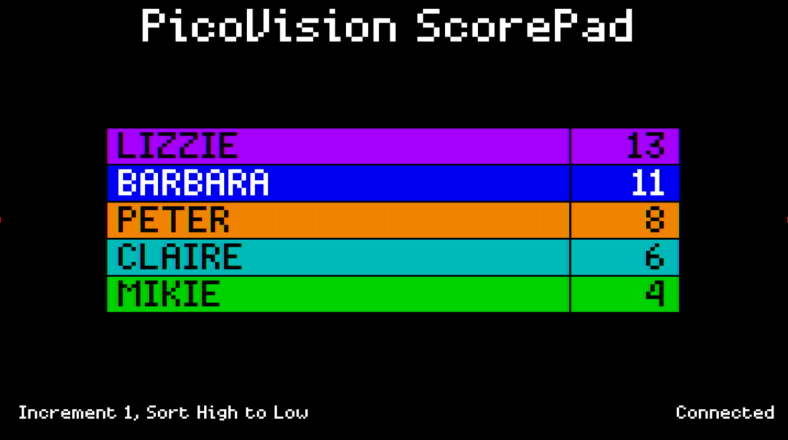

# PicoVision ScorePad

A score pad for keeping track of your score in a card game or board game.

This works with an 8BitDo Zero 2, in Android mode.  You'll need to set the address of your device in `bt_hid.c` and then pair it.  Once paired, it should reconnect each time automatically.

Configure the names of people you often play with in `main.cpp`, then before a game remove players that aren't playing with `Y`.

During play, you can sort the scores with `A`.  Change the increment step with `B`.  Change the score sort order with `Select`.

If the game has bidding, enable the bid column by pressing both shoulder buttons together, and then switch between the columns with the left and right shoulder buttons.

| Control    | Function |
| -------    | -------- |
| Up/Down    | Select player |
| Right/Left | Add/subtract score |
| A | Sort by score |
| B | Change score increment (cycles through 1, 5, 10) |
| Y | Remove player |
| X | Unremove last removed player |
| Both shoulders | Enable/disable bid column |
| Left shoulder  | Select bid column |
| Right shoulder | Select score column |
| Select | Change sort order |
| Start | Reset scores |
| Start & Up | Reset all |

## Credits

Bluetooth controller support from [PicoW DS4](https://github.com/usedbytes/picow_ds4)

Design inspired by the excellent ScoreKeeper app for iOS.
